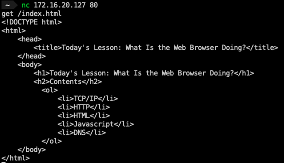

## 사용법
```sh
git clone https://github.com/ybbarng/buzzvil-study.git
cd buzzvil-study/earlybird
python3 tcp_ip_server.py
```
* 1을 입력하면 에코 서버가 실행됨
* 2를 입력하면 HTTP 서버가 실행됨

### 1. 에코 서버

클라이언트가 보낸 메시지의 앞에 조금 덧붙여서 다시 되돌려주는 서버


### 2. HTTP 서버

`get /index.html`을 받으면 [index.html](index.html)파일의 내용을 응답으로 주는 서버



